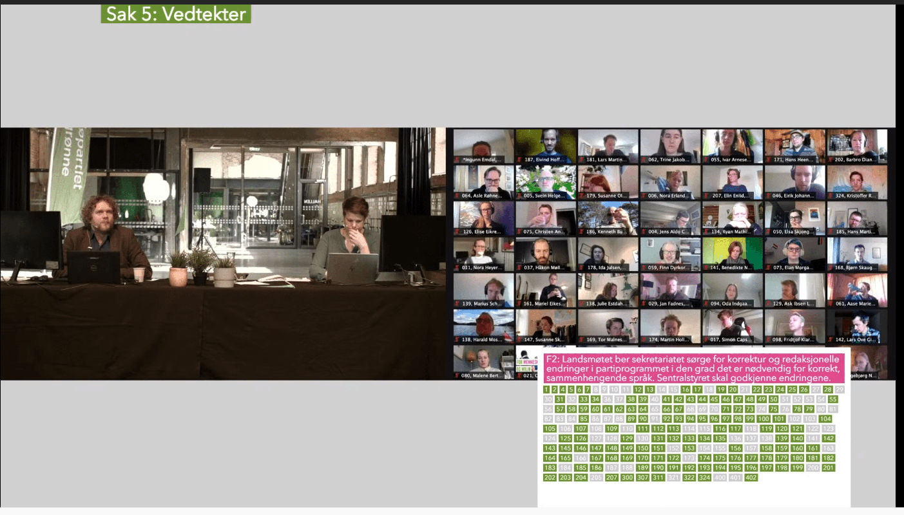
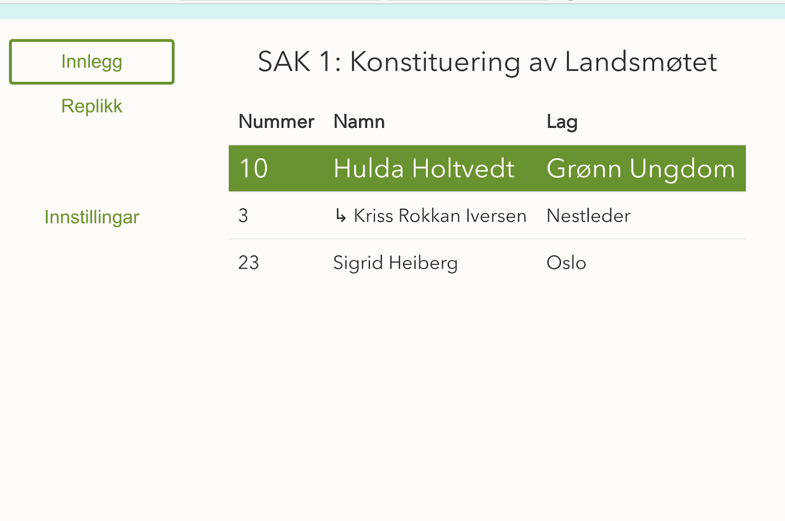
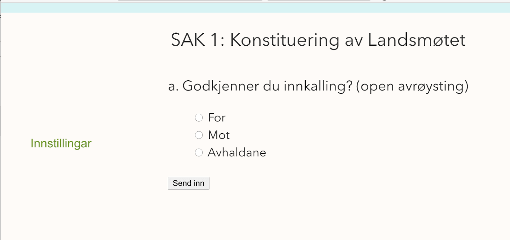
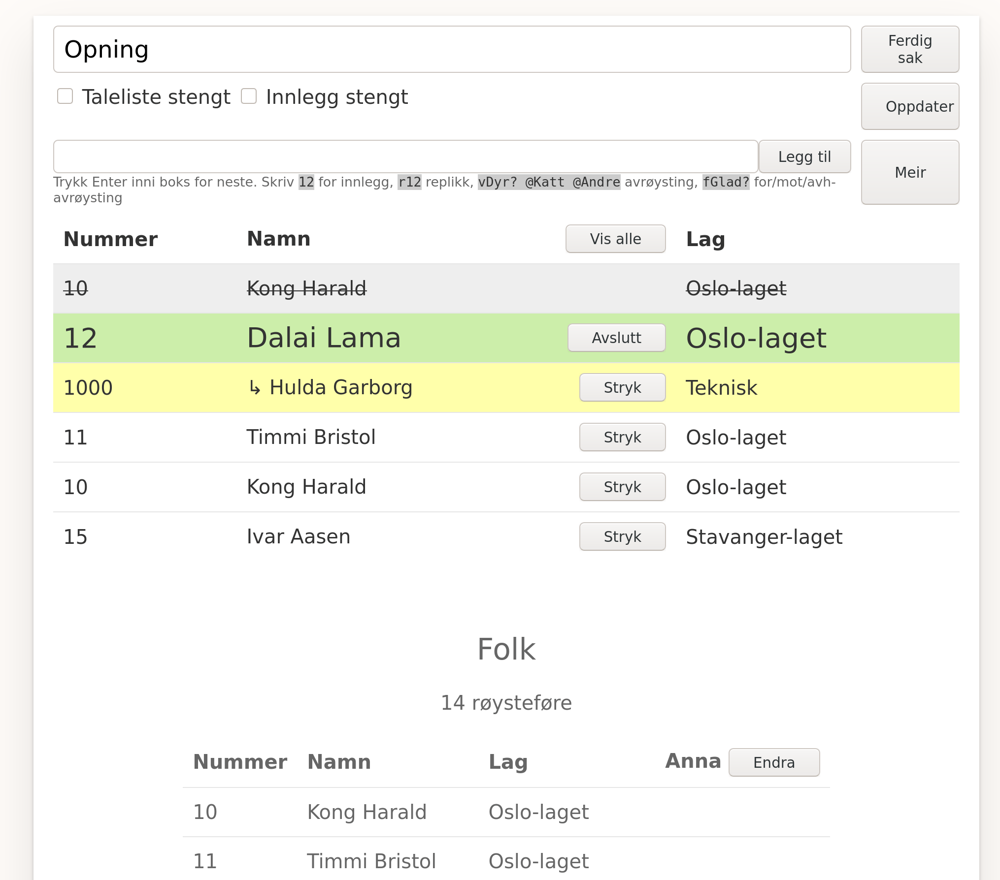

Roiheimen
=========

Basic live voting and speaker list-system for big meetings.

It has been used at:
- Landsmøte 2021 Miljøpartiet Dei Grøne
- Landsmøte 2020 Noregs Mållag (with Whereby-integration)

Setup
-----
- Make sure you have postgresql running, you'll need the `wal2json`
  plugin, and have wal replication set up (see [server
  setup](./pkg/server/README.md)).

- `yarn setup`
- `yarn start`
- Open project at https://localhost:8080/
- Log in with "nummer" `1000` and "kode" `test`.

Code
----
There's two main packages [pkg/server/](./pkg/server) and
[pkg/web](./pkg/web). You can read more about them in their respective
folders.

Usage
-----

How it can look for viewers of your stream (this is using the
`/gfx.html` endpoint). All UI here is from Roiheimen (this is a
referendum).

It also shows a super with name/number once a new speaker starts.

The speech/speaker list. Clicking `[ Innlegg ]` would put you at the
bottom of the list.

Ongoing referendum.

There's also a manage interface those who run the meeting is using:

Configuration
-------------

Each meeting, sak and person has a config object. These exist:

- `voteDisallowNum`: Array of person num's to disallow to vote
- `speechDisabled`: Whether to disallow new speeches (has UI, steng taleliste)
- `speechInnleggDisabled`: Whether to only disallow new "Innlegg" speeches (has UI)
- `hideClosedReferendumResults`: Don't show results of the closed referendums to people
  (this would normally tally up the score)
- `gfxIframeOnQueue`: Show live voting results to all users by (default
 true) - this can be heavy for the server or clients with bad internet
- `userGfxIframeOnQueue`: The user overidden setting
- `stableChoices`: If `true` won't randomize vote choices, but keep them as-is
- `emojis`: If `true` show emoji reactions (not finished)
- `video`: If `false`, disable all video, else a youtube ID for the live stream being shown
- `externalCss`: External CSS to load (only on Meeting)
- `finishedAt`: When to start hiding the meeting on the front page

These are not really used much anymore, it's for fully-remote meetings using Whereby.
- `tests` (Whereby): Allow people to talk to the backroom for tests
- `speechRoom` (Whereby): Which room the speech happens in
- `waitRoom` (Whereby): Which room waiting happens in
- `backroom` (Whereby): The backroom

Special pages
-------------
The client interface is at `/queue.html` and you'll be redirected there
once logging in. The `/manage.html` is where you control the meeting.
However there are some addresses that are not in the menu:

- `/gfx.html` - overlay for use on a livestream of the meeting
- `/fullscreen.html` - used in-meeting to show the audience what is happening.
- `/screen.html` - same as fullscreen, but a bit different display, more features
